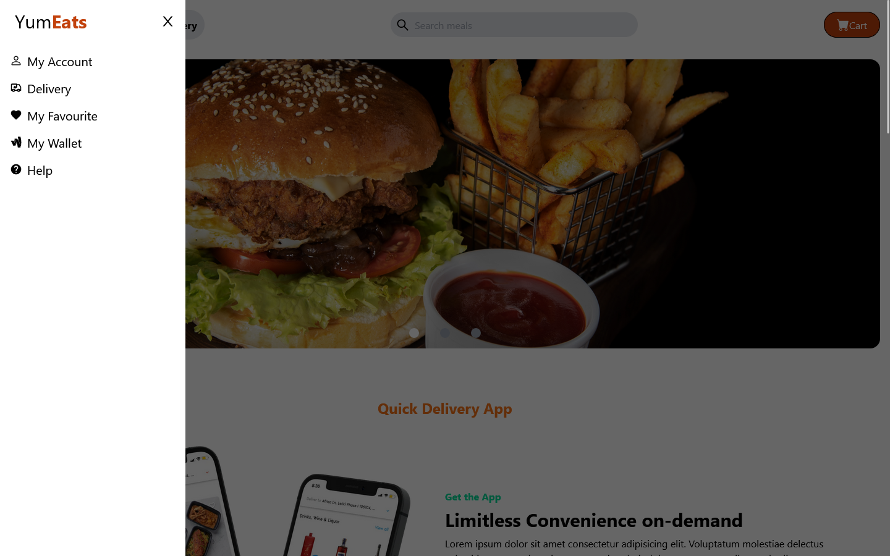
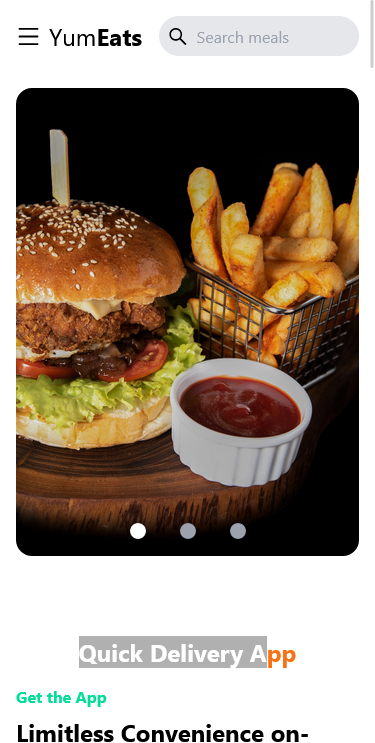

<a name="readme-top"></a>

# 📗 Table of Contents

- [📖 About the Project](#about-project)
  - [🛠 Built With](#built-with)
    - [Tech Stack](#tech-stack)
    - [Key Features](#key-features)
  - [🚀 Live Demo](#live-demo)
  - [📷 Screenshots](#screenshots)
- [💻 Getting Started](#getting-started)
  - [Setup](#setup)
  - [Prerequisites](#prerequisites)
  - [Install](#install)
  - [Usage](#usage)
  - [Run tests](#run-tests)
  - [Deployment](#deployment)
- [👥 Authors](#authors)
- [🔭 Future Features](#future-features)
- [🤝 Contributing](#contributing)
- [⭐️ Show your support](#support)
- [🙏 Acknowledgements](#acknowledgements)
- [❓ FAQ (OPTIONAL)](#faq)
- [📝 License](#license)

# 📖 YumEats <a name="about-project"></a>

**YumEats** it is a simple landing page for a resturant that offers a variety of dishes. it is built using react and styled using tailwindcss. using tailwindcss, the app is responsive and can be viewed on any device.

## 🛠 Built With <a name="built-with"></a>

### Tech Stack <a name="tech-stack"></a>

- [React](https://reactjs.org/)
- [React Icons](https://react-icons.github.io/react-icons/)
- [tailwindcss](https://tailwindcss.com/)
- [postcss](https://postcss.org/)
- [gh-pages](https://www.npmjs.com/package/gh-pages)

### Key Features <a name="key-features"></a>

- The app is responsive and can be viewed on any device.
- The app is built using react and styled using tailwindcss.
- The app is deployed to github pages.

<p align="right">(<a href="#readme-top">back to top</a>)</p>

## 🚀 Live Demo <a name="live-demo"></a>


- [Live Demo Link](https://fmanimashaun.github.io/yumeats/)

## 📷 Screenshots <a name="screenshots"></a>

### Desktop <a name="#desktop"></a>

<p align="center">
  
</P>

### Tablet <a name="#tablet"></a>

<p align="center">
  
</P>

### Mobile <a name="#mobile"></a>

<p align="center">
  
</P>

<p align="right">(<a href="#readme-top">back to top</a>)</p>

## 💻 Getting Started <a name="getting-started"></a>

### Prerequisites <a name="prerequisites"></a>

- [Optional] Install git bash to your machine to enable you to clone this repo.
- install Visual Studio to be able to host a local live version.
- Install a browser to view the local live version.

To get a local copy up and running follow these simple example steps.
### Setup <a name="setup"></a>

Clone this repository to your desired folder:

```sh
  cd your-desired-folder
  git clone https://github.com/fmanimashaun/yumeats.git
  open the repo folder `yumeats`
```

### Install <a name="install"></a>

Install this project dependencies with:

```sh
  npm install
```

### Usage <a name="usage"></a>

To run the project, execute the following command:

```sh
  npm run start
```

Runs the app in the development mode.\
Open [http://localhost:3000/cryptorank-hub](http://localhost:3000/yumeats) to view it in your browser.

The page will reload when you make changes.\
You may also see any lint errors in the console.

### Run tests <a name="run-tests"></a>

To run tests to check the lint errors, run the following command:

- To check for CSS lint errors, run the following command:

```sh
  npm run stylelint
```

- To check for JS lint errors, run the following command:

```sh
  npm run eslinter
```

To run unit tests, run the following command:

```sh
  npm run test
```

Launches the test runner in the interactive watch mode.\
See the section about [running tests](https://facebook.github.io/create-react-app/docs/running-tests) for more information.

### Deployment <a name="deployment"></a>

You can deploy this project to github pages by running the following command:

```sh
  npm run deploy

```

Builds the app for production to the `build` folder.\
It correctly bundles React in production mode and optimizes the build for the best performance.

The build is minified and the filenames include the hashes.\
and it is automatically deployed to the github page.

See the section about [github page deployment](https://github.com/gitname/react-gh-pages) for more information.

<p align="right">(<a href="#readme-top">back to top</a>)</p>

## 👥 Authors <a name="authors"></a>

👤 **Engr. Animashaun Fisayo**

- [GitHub](https://github.com/fmanimashaun)
- [Twitter](https://twitter.com/fmanimashaun)
- [LinkedIn](https://www.linkedin.com/in/fmanimashaun/)
- [Website](https://fmanimashaun.com)

<p align="right">(<a href="#readme-top">back to top</a>)</p>

## 🔭 Future Features <a name="future-features"></a>

- [ ] add to cart functionality
- [ ] add checkout functionality
- [ ] add payment functionality
- [ ] add order tracking functionality
- [ ] add user authentication functionality
- [ ] add admin dashboard functionality

<p align="right">(<a href="#readme-top">back to top</a>)</p>

## 🤝 Contributing <a name="contributing"></a>

Contributions, issues, and feature requests are welcome!

Feel free to check the [issues page](../../issues/).

<p align="right">(<a href="#readme-top">back to top</a>)</p>

## ⭐️ Show your support <a name="support"></a>

If you like this project and want to support me, you can give a ⭐️ to this repo!

<p align="right">(<a href="#readme-top">back to top</a>)</p>


## 🙏 Acknowledgments <a name="acknowledgements"></a>


I would like to thank [Okwuose Ehiedu](https://www.linkedin.com/in/okwuose-ehiedu-7b8923198/) for resources

<p align="right">(<a href="#readme-top">back to top</a>)</p>


## ❓ FAQ (OPTIONAL) <a name="faq"></a>

- **How do I dynamically import multiple images within my project directory?**

    - I used the [require.context](https://webpack.js.org/guides/dependency-management/#requirecontext) method to dynamically import multiple images within my project directory.
    
    ```js
    const importAll = (r) => {
      const images = {};
      r.keys().forEach((key) => {
        const imageName = key.replace(/^.+\/([^/]+)\.[^.]+$/, '$1'); // Extracts the image name from the path
        images[imageName] = {
          name: imageName.replace(/_/g, ' '), // Replaces underscores with spaces
          path: r(key),
        };
      });
      return Object.values(images);
    };

    // then you can call the function inside your component

    const Slider = () => {
      const ImagesArray = importAll(
        require.context('path to image folder', false, /\.(png|jpe?g|svg)$/),
      );

      // rest of your code
    };
    ```

<p align="right">(<a href="#readme-top">back to top</a>)</p>

## 📝 License <a name="license"></a>

This project is [MIT](./LICENSE) licensed.

<p align="right">(<a href="#readme-top">back to top</a>)</p>
